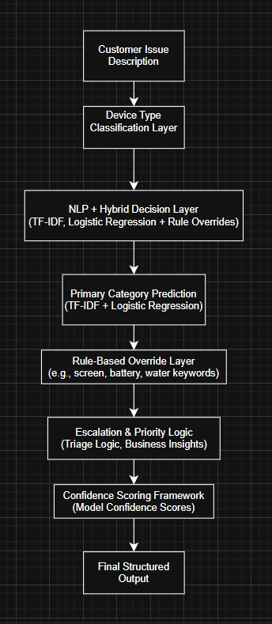
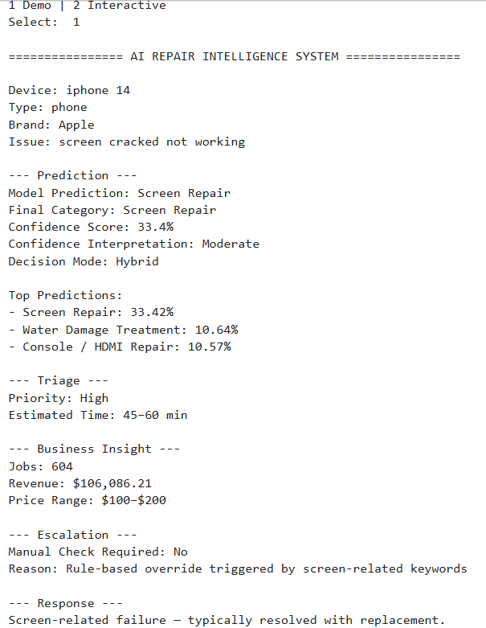
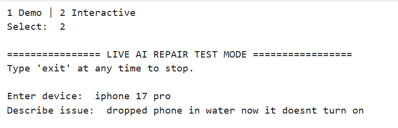
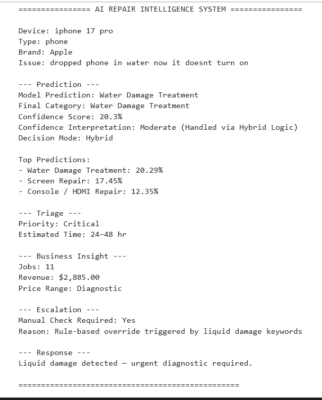

# Paragon Geeks — AI Repair Intelligence System

Hybrid AI System (NLP + Machine Learning + Rule-Based Logic) for Intelligent Repair Triage

---

## Overview

This project implements a hybrid AI-powered repair triage system designed to convert unstructured customer issue descriptions into structured, decision-ready repair recommendations.

The system combines:

- Natural Language Processing (TF-IDF vectorization)
- Machine Learning classification (Logistic Regression)
- Rule-based override logic for critical repair scenarios
- Business intelligence insights derived from real transaction data

Unlike traditional rule-based systems, this solution integrates machine learning predictions with operational logic to produce explainable, scalable, and business-aware outputs.

---

## System Architecture



**Layered Decision Pipeline:**
1. Customer Issue Description  
2. Device Type Classification  
3. NLP + Hybrid Decision Layer  
4. Primary Category Prediction (ML Model)  
5. Rule-Based Override Layer  
6. Escalation & Priority Logic  
7. Confidence Scoring Framework  
8. Final Structured Output  

---

## Example Output (Demo Mode)



Each prediction includes:

- Final repair category  
- Confidence score & interpretation  
- Priority level  
- Estimated repair time  
- Business insight (jobs, revenue, pricing)  
- Escalation logic  

---

## Interactive Mode (Real-Time Testing)

### User Input


### System Output


The system supports real-time triage using natural language input, simulating real-world repair intake scenarios.

---

## Key Features

- Hybrid AI decision system (ML + rule-based overrides)  
- Natural language issue classification  
- Confidence scoring with interpretation  
- Priority and escalation logic  
- Business intelligence integration (real-world revenue and job data)  
- Interactive CLI testing mode  
- Multi-category repair coverage  

---

## System Capabilities

The system handles a wide range of real-world repair scenarios:

- Screen damage (cracks, lines, display issues)  
- Battery issues (drain, overheating, swelling)  
- Charging port failures  
- Water / liquid damage  
- Back glass repair  
- Speaker and audio issues  
- Camera malfunctions  
- Console HDMI issues  
- No power / board-level failures  
- General diagnostic cases  

---

## Business Impact

- Standardizes repair intake across technicians  
- Reduces subjectivity in triage decisions  
- Improves operational consistency  
- Enables structured data collection for analytics  
- Bridges real-world operations with AI-driven insights  

---

## Technical Skills Demonstrated

- Natural Language Processing (TF-IDF)  
- Machine Learning (Logistic Regression)  
- Hybrid AI system design  
- Rule-based decision logic  
- Confidence scoring frameworks  
- Feature engineering for text classification  
- Structured output design  
- CLI-based system simulation  

---

## How to Run

1. Clone the repository:
   ```
   git clone https://github.com/YOUR-USERNAME/paragon-ai-repair-intelligence-system.git
   cd paragon-ai-repair-intelligence-system
   ```

2. Install dependencies:
   ```
   pip install -r requirements.txt
   ```
3. Run the system:
   ```
   python paragon_ai_repair_intelligence_system.py
   ```
4. Select mode:
   ```
   1 → Demo Mode
   2 → Interactive Mode
   ```
---

## Example Usage

### Demo Mode

Runs predefined repair scenarios to validate system behavior:

- Screen damage detection  
- Battery degradation cases  
- Charging port issues  
- Water damage scenarios  
- Console HDMI failures  

Each scenario outputs a fully structured repair analysis including prediction, confidence, triage, and business insights.

---

### Interactive Mode

Allows real-time testing using natural language input:

Example:

``` id="fix1"
Enter device: iphone 17 pro
Describe issue: dropped phone in water now it doesnt turn on
```


Output includes:
- Final repair category  
- Confidence score & interpretation  
- Priority level  
- Estimated repair time  
- Business insight (jobs, revenue, pricing)  
- Escalation logic  

---

## Future Enhancements

- Web-based intake interface (Streamlit or Flask)  
- Integration with POS / CRM systems (e.g., Square)  
- Real-time repair analytics dashboards (Power BI / Tableau)  
- Expanded training dataset for improved ML accuracy  
- Automated repair pricing recommendations  
- Multi-language input support  

---

## Project Evolution

This project evolved from a rule-based intake system into a hybrid AI-driven decision engine.

Enhancements include:

- Integration of NLP (TF-IDF) for text processing  
- Machine learning classification using Logistic Regression  
- Hybrid decision logic combining model predictions with rule overrides  
- Confidence scoring with interpretability  
- Business insight integration for real-world applicability  

---

## Author

Kevin Turner II
   
